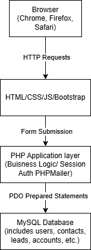

# Exploring CRM Systems Using Generative AI

## Student Information
Ali Ouakhchachi 
- StarID: ls7771en
- StudentID: 16524845

## Executive Summary:
This report documents an AI-assisted exploration of Customer Relationship 
Management (CRM) systems completed as part of ICS499 at Metropolitan State 
University. Using Claude as the primary AI research tool, I investigated CRM 
concepts, compared commercial and open-source products, explored an open-source 
CRM demo environment, and analyzed the architecture of a custom PHP/MySQL CRM.

## AI Tools Used:
Claude, Google Search AI (Gemini)

## CRM Research Findings

CRM (Customer Relationship Management) systems help organizations manage 
interactions with current and potential customers. Key findings from this 
research include:

- CRM systems originated in the 1980s as simple contact databases and have 
  evolved into cloud-based platforms with AI-driven analytics
- Core modules found across most CRMs include Contacts, Leads, Opportunities, 
  Tasks, and Reports
- Organizations across retail, healthcare, education, and nonprofits use CRM 
  to reduce manual work, improve communication, and track customer relationships
- Salesforce dominates the commercial market while EspoCRM and SuiteCRM are the 
  most mature open-source alternatives

  See [crm_research.md](./crm_research.md) for the full research breakdown.

# Part 2: AI-Assisted CRM Product Comparison

## Commercial CRM Products:
| Product | Target Customer | Strengths | Weaknesses | Pricing Model |
| --- | --- | --- | --- | --- |
| Salesforce | Teams that need deep customization and complex sales cycles. | High customization/ territory management and largest app ecosystem. | High cost, steep learning curve, overwhelming for smaller teams or simple use cases. | $25 - $300 (per user/month) |
| HubSpot CRM | Mid-market companies and sales teams wanting ease of use. | Free tier available, best in-class UI for ease of use, native marketing on one database. | Pricing escalates quicklt as contact list grows, limited sales pipeline customization vs. Salseforce, restrictive features compared to other higher end CRMs. | Free - $120 (per user/month) |
| Oracle CRM | Large companies with complex data-heavy operations already using Oracle infastructure. | Seamless integration with Oracle systems like Oracle ERP, handles comples multi-department entreprise processes, strong in fields like life sciences, automotive, etc. | Ui feels dated compared to Salesforce or Hubspot, VERY steep learning curve, customization is limited compared to Oracle Siebel (predecessor) | Custom Pricing (around $65-$300 per user) |

## Open Source CRM Products:
| Product | Features | Technology Stack | Community Support | Ease of Installation |
| --- | --- | --- | --- | --- |
| SuiteCRM | Full sales automation & pipeline, Marketing Campaign & Customer Service management, Role-based access control | PHP (Backend), MySQL(Database), AGPL (License), LAMP (Stack) | Large Active Global & Github Community, Open Collective funding model | Moderate (requires LAMP stack setup) |
| EspoCRM | Sales pipeline management, Email marketing & campaigns, Customer support ticketing | PHP (Backend), MySQL(Database), AGPL (License), LAMP + Docker (Stack) | Growing Community, Major UI/Automation updates in 2025-26 (although smaller than SuiteCRM and Odoo) | Easiest (Docker-based install, everything already preconfigured) |
| Odoo CRM | Drag-and-drop pipeline editor, Lead scoring & email automation, Sales, amrketing , and invoicing in one platform | Python (Backend), PostgreSQL(Database), LGPL (License), Python + PostgreSQL (Stack) | Millions of community users, Strong Documentation, highly popular | Moderate-Hard (Community Edition free. Enterprise modules are paid. Steep learning curve for non-technical users.) |

## Analysis:

### Which commercial CRM appears most popular?
- The most popular one from this list seems to be Salesforce, as though although it is pricey to implement, it has deep customization options and territory management, spreading to a wide variety of companies.
### Which open-source CRM appears most mature?
- SuiteCRM feels the most mature as it is a fork of SugarCRM (dating back to 2004). It covers the full enterprise CRM surface area (sales mangement, pipeline management, marketing campaigns), it has a large community/funding stability, and has the most developer-friendly documentation of open source CRM options.
### Which CRM would you recommend for a small business?
- For a small business, EspoCRM is easy to configure and learn, as it has many automation tools and good community support as well. However if they want more features and a bigger learning curve, Odoo CRM would be a good next step, as its simple interface, low-code workflow, and additional features than EspoCRM.
### Which CRM would you recommend for a large enterprise?
- As mentioned before, although Hubspot does have a smaller learning curve and more intuitive UI, I believe Salesforce is still a powerful CRM for its variety of tools and coverage for complex sale scycles and with how scalable it is.

# Part 3: Open Source CRM Evaluation

## Installation Experience
### Was installation easy?
I utilized EspoCRM's Live Demo CRM feature and it was extremely easy. I only used my browser to navigate it.
### What challenges occurred?
Although the UI was simple to use, it took a minute to figure out where the Analytics tab was, so I needed to search it up.
### How did AI help?
Claude helped reccomend EspoCRM, as it suggested it to be the easiest to use and take screenshots of (just to get a general feel).
## Product Experience
### What features impressed you?
I was impressed with the multitude of features and custimization EspoCRM provided with such a simple UI interface.
### What features were missing?
Compared to Salesforce, it lacks more complex Territory Management and Native AI & Predictive analytics.
### Would you use it in a real organization?
For a small buisness, I feel like EspoCRM would work very well to manage order and customer data in a nice confined space.

## CRM Architecture Proposal

### Functional Modules:
A PHP/MySQL CRM should include core modules such as authentication (Login/Logout, role based access), Contacts to store and manage customer records, accounts to manage companies/organizations linked to contacts, Leads to track potential customers, Opportunities to monitor active sales deals, Tasks to Log calls, emails, and meetings, and Reports to visualize sales data.

### Database Design:
- users: id, name, email, password_hash, role_id, created_at
- roles: id, role_name, permissions
- contacts: id, first_name, last_name, email, phone, account_id
- accounts: id, company_name, industry, website, address
- leads: id, name, email, source, status, assigned_to, created_at
- opportunities: id, name, account_id, value, stage, close_date
- activities: id, type, notes, contact_id, user_id, date
- tickets: id, subject, description, status, contact_id, assigned_to

### Useful Libaries:
- Bootstrap: Responsive layout, forms, buttons, modals (saves writing CSS from scratch)
- DataTables: Turns plain HTML tables into sortable, searchable, paginated tables
- Chart.js: Creates dashboard charts (bar, line, pie) for reports and analytics
- PHPMailer: Sends transactional emails (password resets, notifications) via PHP
- Composer: PHP dependency manager (installs and manages libraries like PHPMailer)

### Security Considerations:
- Authentication: Use PHP sessions, enforce login on every page, set session timeouts
- Authorization: Check user role before showing any sensitive page or action
- Password Security: Hash passwords with password_hash() using bcrypt, never store plain text
- SQL Injection: Use PDO prepared statements for every database query (never concatenate user input into SQL)
- XSS (Cross-Site Scripting): Sanitize all output with htmlspecialchars() before rendering in HTML
- Data Privacy: Use HTTPS, limit data exposure to only what each role needs to see

### MVP Proposal:
The smallest useful CRM would include just enough to track customers and sales activity:
- Version 1 would include: User Login, Contacts, Leads, an Activty log, and a Simple Dashboard

### Architecture Diagram:

## Prompt Engineering Examples
Some of my favorite prompts:
- "Act as a software consultant. Explain what CRM systems are, their history, and how they've evolved."
- "What should I look for when evaluating an open-source CRM like EspoCRM?"
- "Which open-source CRM appears most mature?"

## Lessons Learned
I leanred that with an AI partner, it's easy to get personalized easy to understand answers that gave more interesting insight about topics I was unfamiliar about. Although some of it does sometimes need fact checking whenever some answers feel questionable, the utilization of this technology does feel like a big next step in assisting with research and giving insight. I was very much surprised with how accurate it was about CRMs and explaining the concept and architecture in ways I hadn't considered from CRMs. It gave me insight as to what they actually are and how they are usually operated. Next time, I'd try to give it more indepth prompts so it can be able to give strict answers and not go off track with what I ask. Overall, a successful experience.

## References
+ https://www.membrain.com/blog/a-brief-history-of-the-crm
+ https://claude.ai/
+ https://www.salesforce.com/news/stories/idc-crm-market-share-ranking-2025/